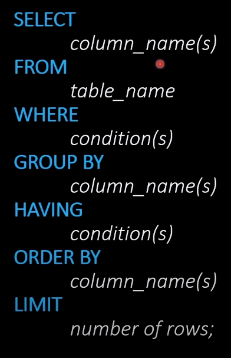
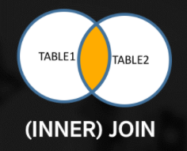
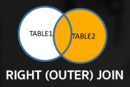
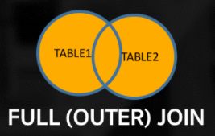
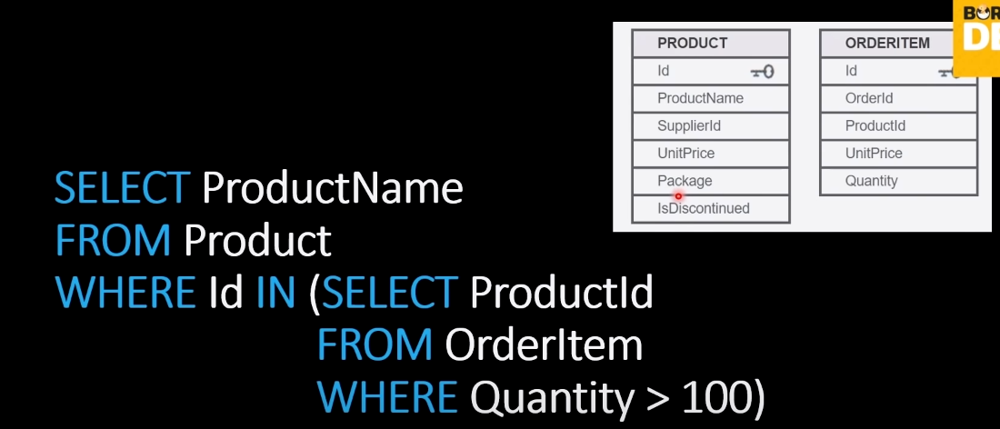
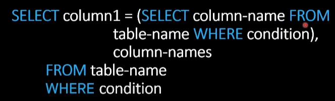

# SQLDojo Test From Laptop Junior

> # `Relational Database`
>
> คือ database แบบที่มีความสัมพันธ์
>
> **คุณสมบัติ**
>
> - แต่ละ Table จะมีหรือไม่มี Primary Key(Unique key)ก็ได้ ถ้ามี Primary Key ข้อมูลจะไม่มีทางซ้ำกัน (`Primary Key จะไม่ซ้ำกัน`)
> - field ใน Table เรียกว่า column

> # `SQLite`
>
> คือ Relational Database ที่อยู่บนเครื่องเรา (Local Database)

> # `SQL`
>
> คือ programming language ที่ใช้ในการจัดการกับ Relational Database เช่น
>
> - insert
> - delete
> - update
> - query
>
> `Note : ` string ใน SQL จะครอบด้วย `" "` หรือ `' '` ก็ได้
>
> `Note : ` lower case(ตัวพิมพ์เล็ก),upper case(ตัวพิมพ์ใหญ่) ใน SQL เขียนได้หมด
>
> ## _`SELECT`_
>
> => เป็น command ที่เอาไว้เรียกแสดงผล data
>
> ```
> SELECT "ชื่อfield(column)" FROM "ชื่อTable";
>
> SELECT * FROM customers;
>
> SELECT FirstName,LastName FROM customers;
> ```
>
> `Note :` `* ` คือทุก field (column)
>
> `Note :` ชื่อ field (column) lower case, upper case ไม่มีผลใส่ได้หมด
>
> ## _`AS`_
>
> => เป็น command ที่เอาไว้กำหนดชื่อ field (column) ที่เราอยากให้แสดงออกมาโดยไม่ได้ใช้ชื่อ field เดิม (`ใช้กำหนดชื่อ field ใหม่ตอนแสดงผล`)
>
> ```
> SELECT
> 	FirstName AS customer_firstName,
> 	LastName AS customer_lastName
> FROM customers;
> ```
>
> `Note : `
>
> - ต้องการให้ field FirstName แสดงออกมาเป็น customer_firstName
> - ต้องการให้ field LastName แสดงออกมาเป็น customer_lastName
>
> ## _`WHERE`_
>
> => เป็น command เอาไว้ query โดยใส่เงื่อนไขของการ query ที่เราต้องการลงไป เพื่อดึง data เฉพาะที่เราต้องการ
>
> ```
> SELECT * FROM customers
> WHERE CustomerId = 8;
>
> SELECT * FROM customers
> WHERE Country = 'Canada'
> AND State = 'ON';
>
> SELECT * FROM customers
> WHERE Country = 'Canada'
> OR Country = 'USA';
> ```
>
> `Note : ` สามารถใช้ logic _`AND`_,_`OR`_ ได้
>
> ## _`ORDER BY`_
>
> => เป็น command ที่เอาไว้เรียง data ตามเงื่อนไข
>
> ```
> SELECT * FROM customers
> WHERE Country = 'Canada'
> ORDER BY "ชื่อfieldที่ต้องการจะใช้เป็นเงื่อนไขในการเรียง";
>
> defalut น้อย => มาก
> SELECT * FROM customers
> WHERE Country = 'Canada'
> ORDER BY FirstName;
>
> มาก => น้อย
> SELECT * FROM customers
> WHERE Country = 'Canada'
> ORDER BY FirstName DESC;
> ```
>
> `Note : ` default ของ `ORDER BY` คือเรียงจากน้อยไปหามาก ถ้าต้องการเรียงจากมากไปหาน้อยให้ใช้ `DESC` (Descending) ต่อท้าย `ORDER BY`
>
> ## _`LIMIT`_
>
> => เป็น command ที่เอาไว้จำกัด data ที่จะเอามาแสดง
>
> ```
> SELECT * FROM customers
> WHERE Country = 'Canada'
> ORDER BY CustomerId DESC
> LIMIT 5;
> ```
>
> ## _`INSERT`_
>
> => เป็น command ที่เอาไว้เพิ่ม data เข้าไปใน Table ของ database
>
> **Approach 1**
>
> ```
> INSERT INTO "ชื่อTable"
> VALUES("ใส่ค่าเรียงตามลำดับของ field ใน Table");
>
> INSERT INTO customers
> VALUES(60,'Jomphop','Saibuatong','2BSimple Co.',
> '171/281 Khonkaen','Khonkaen','KH','Thailand','40000',
> '0845167512',NULL,'Jomphop.Saibuatong@hotmail.com',3);
> ```
>
> `Note : ` บาง field ไม่สามารถเป็น `NULL` ทำให้ไม่สามารถ INSERT ได้ ควรระวัง
>
> **Approach 2**
>
> ```
> INSERT INTO "ชื่อTable" ("เฉพาะชื่อ field ที่เราต้องการจะใส่ Value เพื่อ INSERT")
> VALUES("ใส่ค่าเรียงตามลำดับของ field ที่กำหนดไว้ข้างบน");
>
> INSERT INTO customers (FirstName,LastName,Email)
> VALUES('Kant','Saibuatong','Kant@hotmail.com');
> ```
>
> ## _`UPDATE`_
>
> => เป็น command ที่เอาไว้ update ข้อมูลแต่ละ field ใน record ของ Table
>
> ```
> UPDATE "ชื่อ Table"
> SET
> "ชื่อ field ที่ต้องการจะ update" = value ใหม่ที่ต้องการจะ update,
> "ชื่อ field ที่ต้องการจะ update" = value ใหม่ที่ต้องการจะ update
> WHERE "เงื่อนไขของ record ที่ต้องการจะ update ข้อมูล";
>
> UPDATE customers
> SET
> FirstName = 'KantWhenUpdate',
> LastName = 'SaibuatongWhenUpdate'
> WHERE CustomerId = 61;
> ```
>
> `Note : ` ระวังทุกครั้งที่เรา `UPDATE` ถ้าไม่ใส่ `WHERE` มันจะ Update ให้ทุก record บน Table
>
> ## _`DELETE`_
>
> => เป็น command ที่เอาไว้ลบ data ออกจาก Table
>
> ```
> DELETE FROM "ชื่อ Table"
> WHERE "เงื่อนไขของ record ที่ต้องการจะลบ";
>
> DELETE FROM customers
> WHERE CustomerId = 61;
> ```
>
> `Note : ` `DELETE` ถ้าไม่ใส่ `WHERE` มันจะ delete ทุก record บน Table
>
> ## **`Aggregate Function`**
>
> => เป็นชุดของ command ที่เอาไว้จัดการคำนวณ data เช่น หา sum, average, max, min, count เป็นต้น
>
> `Note : ` `Aggregate Function` เราใส่หลัง `SELECT` เสมอ
>
> `Note : ` `WHERE` ไม่สามารถใช้กับ `Aggregate Function` ได้, `WHERE` ใช้กับการเลือกค่าปกติจาก Table เท่านั้น
>
> `Note : ` `WHERE` ไม่สามารถใช้กับ `AS` ได้, `WHERE` ใช้กับการเลือกค่าปกติจาก Table เท่านั้น ซึ่ง `AS` มันเป็นแค่ชื่อใหม่ที่เอาไว้แสดงผล ไม่ได้เปลี่ยนชื่อ field ถาวร
>
> `Note : ` `Aggregate Function` เป็นชุดคำสั่งที่ใช้สำหรับคำนวณ data เพราะฉะนั้นเราสามารถ +,-,\*,/ กับ `Aggregate Function` ได้ด้วย
>
> ```
> Ex.
> SELECT AVG(Milliseconds) / 60000
> FROM tracks;
>
> SELECT AVG(Milliseconds) / 60000 AS Avg_Minute
> FROM tracks;
> ```
>
> ### _`COUNT`_
>
> => เป็น command ที่เอาไว้นับจำนวน data ใน Table
>
> ```
> SELECT COUNT("ชื่อ field ที่ต้องการจะนับจำนวน")
> FROM "ชื่อ Table"
> WHERE "เงื่อนไข data ที่ต้องจะนับ";
>
> SELECT COUNT(FirstName)
> FROM customers
> WHERE City = 'Paris';
>
> SELECT COUNT(FirstName)
> FROM customers;
> ```
>
> `Note : ` `COUNT` ถ้าไม่ใส่ `WHERE` จะนับจำนวน data ทั้งหมดใน Table
>
> `Note : ` ถ้าต้องการนับ data ทั้งหมดจะ `SELECT` field ไหนก็ได้ หรือ เอาทุก field (`*`)
>
> ### _`(AVG)AVERAGE`_
>
> => เป็น command ที่เอาไว้หาค่าเฉลี่ยของ data
>
> ```
> SELECT AVG("ชื่อ field ที่ต้องการจะหาค่าเฉลี่ย")
> FROM "ชื่อ Table";
>
> SELECT AVG(Total)
> FROM invoices;
> ```
>
> ### _`SUM`_
>
> => เป็น command ที่เอาไว้หาผลรวมของ data
>
> ```
> SELECT SUM("ชื่อ field ที่ต้องการจะหาผลรวม")
> FROM "ชื่อ Table";
>
> SELECT SUM(Total)
> FROM invoices;
> ```
>
> ### _`MAX`_
>
> => เป็น command ที่เอาไว้ใช้หาค่า Maximum
>
> ```
> SELECT MAX("ชื่อ field ที่ต้องการจะหาค่าที่มากที่สุด")
> FROM "ชื่อ Table";
>
> SELECT MAX(Total)
> FROM invoices;
> ```
>
> ### _`MIN`_
>
> => เป็น command ที่เอาไว้ใช้หาค่า Minimum
>
> ```
> SELECT MIN("ชื่อ field ที่ต้องการจะหาค่าที่น้อยที่สุด")
> FROM "ชื่อ Table";
>
> SELECT MIN(Total)
> FROM invoices;
> ```
>
> ### _`GROUP BY`_
>
> => เป็น command ที่เอาไว้ใช้ในการ Group ระหว่าง Value กับ Field
>
> ```
> SELECT "Aggregate Function","field ที่ต้องการจะเอามา Group"
> FROM "ชื่อ Table"
> GROUP BY "field ที่ต้องการจะเอามา Group";
>
> SELECT COUNT(CustomerId),City
> FROM Customers
> GROUP BY City;
> ```
>
> `Note : ` `Aggregate Function` ที่มักจะเอามาใช้กับ `GROUP BY` คือ `COUNT`, `AVG`, `SUM` เป็นต้น
>
> `Note : `
>
> ```
> SELECT COUNT(CustomerId) AS Qrt,Country
> FROM Customers
> GROUP BY Country
> ORDER BY COUNT(CustomerId);
>
> SELECT COUNT(CustomerId) AS Qrt,Country
> FROM Customers
> GROUP BY Country
> ORDER BY Qrt;
>
> *** ORDER BY จะเลือกใช้ชื่อ field เก่า หรือ ชื่อ field ใหม่ (AS) ก็ได้
> ```
>
> ### _`HAVING`_
>
> => เป็น command ที่ใช้แทน `WHERE` สำหรับใช้กับ `Aggregate Function`
>
> ```
> SELECT COUNT(CustomerId) AS Qrt,Country
> FROM Customers
> GROUP BY Country
> HAVING COUNT(CustomerId) >= 5
> ORDER BY Qrt;
>
> SELECT COUNT(CustomerId) AS Qrt,Country
> FROM Customers
> GROUP BY Country
> HAVING Qrt >= 5
> ORDER BY Qrt;
> ```
>
> `Note : ` `HAVING` อยู่หลัง `GROUP BY` เสมอ
>
> ## **`ลำดับ command SQL`**
>
> 
>
> ## **`SQL Operators`**
>
> ### _`NOT`_
>
> => เป็น SQL operator ที่เป็น not
>
> ```
> SELECT * FROM employees
> WHERE NOT Title = 'IT Staff';
>
> ความหมายคือ SELECT เอาทุก field จาก Table employees ทุกตัวที่ Title ไม่เป็น "IT Staff"
> ```
>
> ### _`IN`_
>
> => เป็น SQL operator ที่เป็น contain
>
> ```
> SELECT * FROM "ชื่อ Table"
> WHERE
> "ชื่อ field" IN ('Value ที่จะ contain');
>
> SELECT * FROM employees
> WHERE
> Title IN ('Sales Support Agent','Sales Manager','General Manager');
>
> IN ใช้แทน case ข้างล่างนี้
> SELECT * FROM employees
> WHERE
> Title = 'Sales Support Agent' OR Title = 'Sales Manager' OR Title = 'General Manager';
> ```
>
> `Note : ` การเรียงลำดับใน `IN` ไม่มีผลต่อการเรียงข้อมูลที่แสดงออกมา ลำดับการเรียงขึ้นอยู่กับลำดับของข้อมูลบน Table
> `Note : ` not contain
>
> ```
> Approach 1
> SELECT * FROM customers
> WHERE
> Country NOT IN ('Brazil','USA','Sweden');
>
> Approach 2
> SELECT * FROM customers
> WHERE
> NOT Country IN ('Brazil','USA','Sweden');
> ```
>
> ### _`LIKE`_
>
> => เป็น SQL operator ที่ใช้เป็น startWith,lastWith
>
> ```
> SELECT * FROM "ชื่อ Table"
> WHERE
> "ชื่อfield" LIKE 'ขึ้นต้นด้วยอะไร%ลงท้ายด้วยอะไร';
>
> -> startWith
> SELECT * FROM customers
> WHERE
> FirstName LIKE 'A%';
>
> -> lastWith
> SELECT * FROM customers
> WHERE
> FirstName LIKE '%a';
>
> -> contain
> SELECT * FROM customers
> WHERE
> FirstName LIKE '%b%';
>
> -> contain & lastWith
> SELECT * FROM customers
> WHERE
> FirstName LIKE '%b%t';
>
> -> startWith & lastWith
> SELECT * FROM customers
> WHERE
> FirstName LIKE 'R%t';
> ```
>
> `Note : ` % เป็น `keyword` ที่ใช้กำหนดดังนี้
>
> - `LIKE` 'keyword%' startWith ด้วย keyword
> - `LIKE` '%keyword' lastWith ด้วย keyword
> - `LIKE` '%keyword%' ขึ้นต้นหรือลงท้ายด้วยอะไรก็ได้ที่มี keyword แทรกอยู่ระหว่าง (`มี keyword อยู่ใน string ตรงไหนก็ได้`)
>
> `Note : ` ในการใช้ `LIKE` แล้วใช้ `%` ต้องใช้ `' '` ครอบเท่านั้น ใช้ `" "` ไม่ได้
>
> ### _`BETWEEN`_
>
> => เป็น SQL operator ที่เอาไว้ใช้กับ context ช่วงระหว่าง
>
> ```
> SELECT * FROM customers
> WHERE
> CustomerId BETWEEN 10 AND 35;
>
> -> Not BETWEEN approach 1
> SELECT * FROM customers
> WHERE
> NOT CustomerId BETWEEN 10 AND 35;
>
> -> Not BETWEEN approach 2
> SELECT * FROM customers
> WHERE
> CustomerId NOT BETWEEN 10 AND 35;
> ```
>
> `Note : ` `BETWEEN` มากับ `AND` เสมอ
>
> ### _`IS NULL`_
>
> => เป็น SQL operator ที่เอาไว้เช็คว่าเป็น null (`ไม่มีค่า`)
>
> ```
> SELECT * FROM "ชื่อ Table"
> WHERE
> "ชื่อ field" IS NULL;
>
> SELECT * FROM customers
> WHERE
> Fax IS NULL;
>
> -> IS NOT NULL Approach 1
> SELECT * FROM customers
> WHERE
> Phone IS NOT NULL;
>
> -> IS NOT NULL Approach 2
> SELECT * FROM customers
> WHERE
> NOT Phone IS NULL;
> ```
>
> `Note : ` `null` กับ `" "` ไม่เหมือนกัน ระวังดึๆ
>
> - `null` => คือไม่มีค่าเลย เป็น null
> - `" "` => มีค่าเป็น white space
>
> ### _`AND`_,_`OR`_
>
> ```
> SELECT * FROM customers
> WHERE
> Country = 'Italy' AND State = 'RM';
>
> SELECT * FROM customers
> WHERE
> Country = 'Brazil' OR State = 'SP';
> ```
>
> `Note : ` ระวังเรื่องการใส่ ( ) ครอบเงื่อนไขของ operator ให้ดีถ้าใส่ผิด logic จะเพี้ยนทันที
>
> ## **`JOIN`**
>
> => เป็น command ที่เอาไว้ join Table เข้าด้วยกันด้วย `key`
>
> ### _`INNER JOIN`_
>
> => เป็นการ join Table ที่ intersect กัน
>
> 
>
> ```
> SELECT *
> FROM invoices INNER JOIN customers
> ON invoices.CustomerId = customers. CustomerId;
>
> SELECT invoiceId,FirstName,LastName
> FROM invoices INNER JOIN customers
> ON invoices.CustomerId = customers.CustomerId;
>
> ```
>
> `Note : ` ตอน SELECT field มาใช้ สามารถระบุชื่อ Table พร้อมกับ field ของ Table ได้ เผื่อ Table ที่ join กันมีชื่อ field ซ้ำกัน จะได้ระบุว่าเราจะเอาชื่อ field มาจาก Table ไหน
>
> ```
> SELECT invoices.invoiceId,customers.FirstName,customers.LastName
> FROM invoices INNER JOIN customers
> ON invoices.CustomerId = customers. CustomerId;
> ```
>
> ### _`LEFT (OUTER) JOIN`_
>
> => เป็นการ join Table โดยที่จะเอา Table ทางซ้ายมาทุกตัวรวมกับที่ intersect กับทางขวา
>
> 
>
> ```
> SELECT Customers.CustomerName, Orders.OrderID
> FROM Customers LEFT JOIN Orders
> ON Customers.CustomerID = Orders.CustomerID;
> ```
>
> ### _`RIGHT (OUTER) JOIN`_
>
> => เป็นการ join Table โดยที่จะเอา Table ทางขวามาทุกตัวรวมกับที่ intersect กับทางซ้าย
>
> 
>
> ```
> SELECT Orders.OrderID, Employees.LastName, Employees.FirstName
> FROM Orders RIGHT JOIN Employees
> ON Orders.EmployeeID = Employees.EmployeeID;
> ```
>
> `Note : `การ `LEFT,RIGHT JOIN` ส่วนที่ไม่ได้ถูก intersect กันจะไม่มีข้อมูล
>
> ### _`FULL (OUTER) JOIN`_
>
> => เป็นการ join Table โดยที่จะเอา Table ทางขวากับทางซ้ายมาทุกตัว
>
> 
>
> ```
> SELECT Customers.CustomerName, Orders.OrderID
> FROM Customers FULL OUTER JOIN Orders
> ON Customers.CustomerID=Orders.CustomerID
> ```
>
> `Note : ` การ `LEFT,RIGHT JOIN`
>
> - LEFT => ข้อมูลทางซ้ายจะต้องครบ แต่ทางขวาไม่ครบก็ได้
> - RIGHT => ข้อมูลทางขวาจะต้องครบ แต่ทางซ้ายไม่ครบก็ได้
>
> `Note : ` การ `JOIN` เราสามารถ JOIN Table เดียวกันได้
>
> ```
> SELECT *
> FROM employees INNER JOIN employees AS employees2
> ON employees.ReportsTo = employees2.EmployeeId;
>
> *** ในการ JOIN Table เดียวกันต้องมีการกำหนด AS ให้ Table 1 ตัว ด้วยเนื่องจากมันจะ error เพราะมันไม่รู้ว่าตอนอ้างอิง Key ใน ON มันจะไปอ้างอิง Table ไหนถ้ามันเป็นชื่อ Table เหมือนกัน เราเลยต้อง AS กำหนดชื่อให้อีก Table นึงเพื่อระบุความชัดเจนให้ sql มันสามารถ execute ได้
>
> SELECT
> employees.EmployeeId,
> employees.FirstName,
> employees.LastName,
> employees.Title,
> employees2.FirstName,
> employees2.LastName
> FROM employees LEFT JOIN employees AS employees2
> ON employees.ReportsTo = employees2.EmployeeId;
>
> *** ในการ JOIN Table เดียวกันตอนจะ SELECT field ควรจะต้องระบุ field พร้อม Table ด้วย ไม่งั้นมันจะ error เพราะว่ามันไม่รู้ว่าจะอ้างอิง Table ไหน เพราะ Table ที่ JOIN กันเป็น Table เดียวกัน
> ```
>
> ## **`CASE`**
>
> => เป็น command ที่เอาไว้กำหนดเงื่อนไขในการประมวลผลของ field
>
> ```
> SELECT InvoiceId,Total,
> CASE
> WHEN Total >= 10 THEN 'AAA'
> WHEN Total < 10 THEN 'AA'
> ELSE 'NONE'
> END AS Result
> FROM invoices;
> ```
>
> `Note : `
>
> - `CASE` เป็นการกำหนดเงื่อนไขก่อนที่จะแสดงออกมาเป็น field ใหม่
> - `CASE` อยู่หลัง `SELECT` เสมอ (`เปรียบเสมือน field`)
>
> `Note : ` ลำดับ `WHEN` ใน `CASE` มีความสำคัญระวังดีๆ ถ้ามันเจอเงื่อนไข `WHEN` ที่เข้าเงื่อนไขก่อน มันจะไม่ทำเงื่อนไข `WHEN` ที่เหลือต่อ
>
> ## **`SubQueries`**
>
> => เป็นการเขียน command query ย่อย
>
>  > 
>
> `Note : ` จากภาพที่ 2 เป็นการ set ค่าให้ column1
>
> `Note : ` การจะใช้ subQuery ควรจะต้องดูด้วยว่ามีวิธีอื่นที่ง่ายกว่ามั้ย ไม่อย่างนั้นอาจจะเป็นการเพิ่มความซับซ้อน
>
> ## **`Comment`**
>
> => เป็นการ comment code ไม่ให้ compile เขียนได้ 2 แบบ
>
> - /_ ...... _/
> - --....
>
> ## **`View,Function,Procedure,Trigger`**
>
> => https://www.tamemo.com/post/114/sql-view-function-procedure-trigger/ (`reference`)
